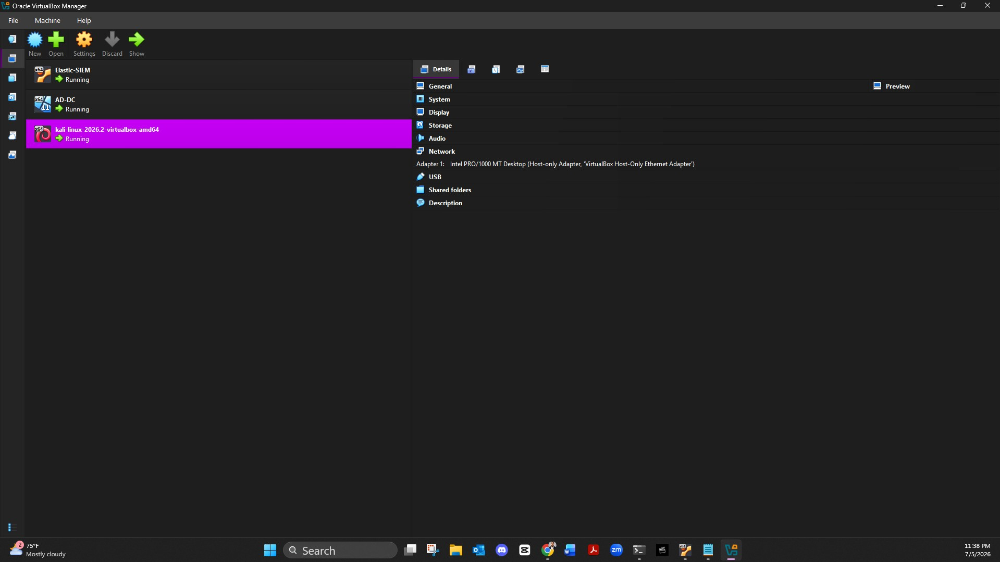
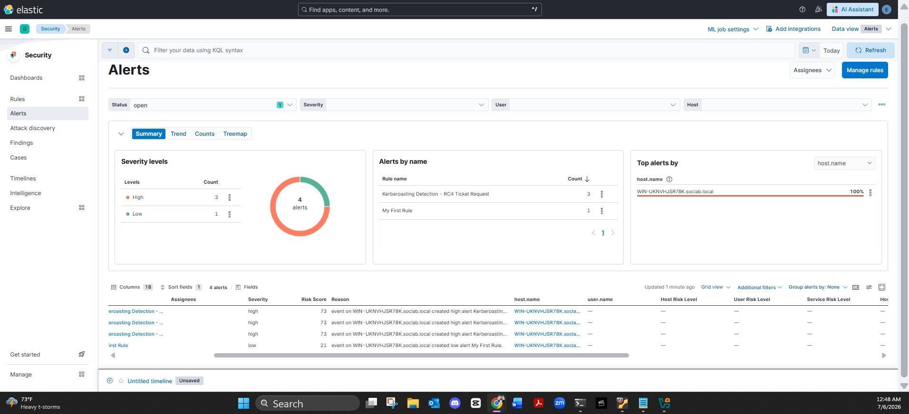
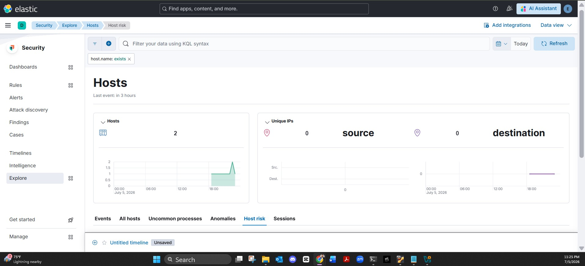
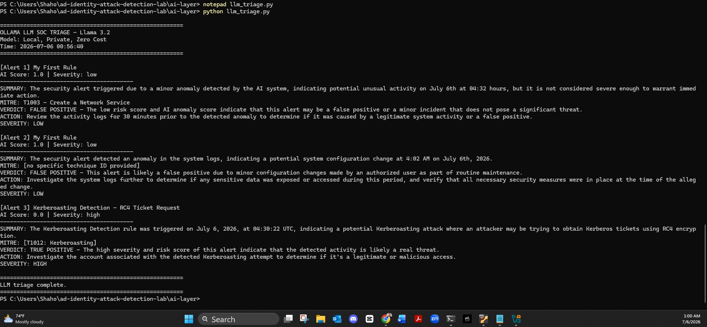
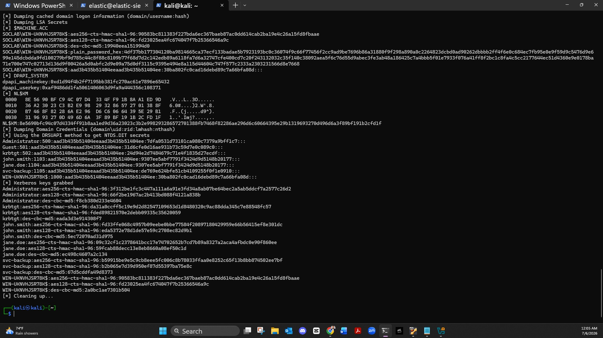

# AI-Augmented Active Directory Identity Attack Detection Lab

> A fully functional SOC detection engineering lab simulating real-world identity-based attacks against Active Directory, with custom Elastic SIEM detection rules, Python ML alert scoring, and local LLM triage via Ollama.

**Built by:** Shaho Ahmed | Cybersecurity Engineer | Detection Engineering | SOC  
**GitHub:** [shahoahmed](https://github.com/shahoahmed) | **LinkedIn:** [shaho-ahmed](https://linkedin.com/in/shaho-ahmed)

---

## Why This Project

Identity attacks are the number one intrusion vector in 2026. 75% of breaches start with compromised credentials. This lab was built to demonstrate hands-on detection engineering capability across the full kill chain: simulate the attack, ingest the telemetry, write the detection rule, score the alert with ML, and triage it with a local LLM.

Every technique simulated is mapped to MITRE ATT&CK and reflects active threat actor TTPs tracked in Mandiant M-Trends 2026 and the SANS 2025 Global SOC Survey.

---

## Lab Architecture

```
[Kali Linux Attacker]          [Windows Server 2022 Domain Controller]
   192.168.56.103                        192.168.56.11
        |                                      |
        |     Host-Only Network (VirtualBox)   |
        |______________________________________|
                           |
                   [Elastic SIEM]
                   Ubuntu 22.04
                   192.168.56.101
                   Elasticsearch + Kibana 8.19.18
```

All VMs run on VirtualBox with a host-only network for isolation. No internet exposure during attack simulations.

---

## Lab Architecture Screenshot



*Three VMs running simultaneously: Elastic SIEM, Windows Server 2022 DC, and Kali Linux attacker*

---

## Attack Techniques Simulated

All techniques are mapped to MITRE ATT&CK and executed using Atomic Red Team and Impacket.

| Technique | MITRE ID | Tool Used | Description |
|---|---|---|---|
| LSASS Credential Dump | T1003.001 | comsvcs.dll via Atomic Red Team | Dumps LSASS memory to extract credential hashes |
| Kerberoasting | T1558.003 | Rubeus via Atomic Red Team | Requests RC4 TGS tickets for service accounts |
| DCSync | T1003.006 | Impacket secretsdump from Kali | Replicates domain credentials using DRSUAPI |
| Scheduled Task Persistence | T1053.005 | Atomic Red Team | Creates multiple persistence mechanisms via schtasks |
| Pass-the-Hash | T1550.002 | Impacket/netexec from Kali | Lateral movement using stolen NTLM hashes |
| Token Impersonation | T1134 | Atomic Red Team | Privilege escalation via token manipulation |

---

## Detection Engineering

### Custom KQL Detection Rule

Built a custom Elastic detection rule targeting RC4 Kerberoasting ticket requests, the specific pattern used by Rubeus and similar tools:

```kql
winlog.event_id: "4769" and winlog.event_data.TicketEncryptionType: "0x17"
```

This fires on Windows Security Event 4769 with RC4 encryption type 0x17, which indicates a Kerberoasting attempt targeting a service account SPN.

**Rule config:**
- Severity: High
- Risk Score: 73
- MITRE: T1558.003
- Schedule: 1 minute intervals
- Look-back: 1 hour

### Alert Firing Screenshot



*Custom Kerberoasting detection rule firing 3 High severity alerts against WIN-UKNVHJSR78K.soclab.local after Rubeus execution*

---

## Telemetry Pipeline

```
Windows Security Logs + Sysmon Events
           |
     Winlogbeat 8.19.18
           |
    Elasticsearch 8.19.18
           |
     Kibana Security
    (Detection Rules + Alerts)
```

**Sysmon config:** SwiftOnSecurity sysmonconfig-export.xml  
**Events collected:** Sysmon Operational, Windows Security, System  
**Elastic index:** winlogbeat-8.19.18

### Live Telemetry Screenshot



*Kibana Security Hosts page showing 2 hosts with live event telemetry flowing from the Domain Controller*

---

## AI Integration Layer

### Python Isolation Forest Alert Scorer

Pulls live alerts from the Elastic API and scores each one using scikit-learn Isolation Forest. Ranks alerts by anomaly score so analysts triage the highest-signal events first.

**File:** `ai-layer/isolation_scorer.py`

```python
from elasticsearch import Elasticsearch
from sklearn.ensemble import IsolationForest

# Connects to Elastic, pulls alerts, extracts features
# (hour of day, severity, risk score), scores with Isolation Forest
# Outputs ranked list and saves top 5 to scored_alerts.json for LLM triage
```

**Output example:**
```
AI ALERT SCORER - Isolation Forest
Found 5 alerts. Scoring with Isolation Forest...

[normal] Score: 1.0 | My First Rule | Severity: low
[normal] Score: 0.0 | Kerberoasting Detection - RC4 Ticket Request | Severity: high
Total alerts scored: 5
Top 5 saved to scored_alerts.json for LLM triage
```

### Ollama Llama 3.2 LLM Triage Assistant

Passes each scored alert to a local Llama 3.2 model running via Ollama. The LLM acts as a senior SOC analyst and returns a structured triage summary: what happened, MITRE mapping, TRUE/FALSE POSITIVE verdict, and recommended action.

**File:** `ai-layer/llm_triage.py`

**Zero cloud dependency. Zero cost. Runs entirely on local hardware.**

### LLM Triage Output Screenshot



*Llama 3.2 correctly identifying the Kerberoasting alert as TRUE POSITIVE with HIGH severity and recommending account investigation*

---

## DCSync Attack Evidence



*DCSync attack via Impacket from Kali dumping all domain credential hashes including Administrator, krbtgt, john.smith, jane.doe, and svc-backup*

---

## Elastic Security Dashboard


---

## Tech Stack

| Category | Tools |
|---|---|
| SIEM | Elastic Stack 8.19.18 (Elasticsearch, Kibana, Winlogbeat) |
| Endpoint Telemetry | Sysmon 15.21 with SwiftOnSecurity config |
| Virtualization | Oracle VirtualBox 7.2 |
| Operating Systems | Ubuntu 22.04, Windows Server 2022, Kali Linux 2026.2 |
| Attack Simulation | Atomic Red Team, Impacket, Rubeus, netexec |
| AI and ML | Python scikit-learn (Isolation Forest), Ollama Llama 3.2 |
| Detection | Custom KQL rules, Elastic prebuilt rules (MITRE ATT&CK mapped) |
| Languages | Python 3.13, KQL, PowerShell, Bash |

---

## Repository Structure

```
ad-identity-attack-detection-lab/
|
|-- ai-layer/
|   |-- isolation_scorer.py      # Isolation Forest alert scoring
|   |-- llm_triage.py            # Ollama LLM triage assistant
|   |-- scored_alerts.json       # Sample scored alert output
|
|-- screenshots/
|   |-- 01-lab-architecture-vms-running.jpg
|   |-- 02-kerberoasting-alert-firing.jpg
|   |-- 03-ollama-llm-triage-true-positive.jpg
|   |-- 04-kibana-hosts-live-telemetry.jpg
|   |-- 05-dcsync-credential-dump-kali.jpg
|
|-- README.md
```

---

## Key Results

- Custom Kerberoasting detection rule fired on live RC4 ticket requests from Rubeus
- Elastic ML anomaly detection jobs configured and running with 30-day trial license
- Python Isolation Forest scorer successfully pulled and scored live Elastic alerts
- Local Llama 3.2 LLM correctly triaged Kerberoasting alert as TRUE POSITIVE
- Full telemetry pipeline validated: Sysmon to Winlogbeat to Elasticsearch to Kibana to Python AI layer
- DCSync credential dump captured all domain hashes including Administrator and krbtgt

---

## MITRE ATT&CK Coverage

| Tactic | Technique | ID |
|---|---|---|
| Credential Access | OS Credential Dumping: LSASS Memory | T1003.001 |
| Credential Access | OS Credential Dumping: DCSync | T1003.006 |
| Credential Access | Steal or Forge Kerberos Tickets: Kerberoasting | T1558.003 |
| Lateral Movement | Use Alternate Authentication Material: Pass the Hash | T1550.002 |
| Persistence | Scheduled Task/Job: Scheduled Task | T1053.005 |
| Privilege Escalation | Access Token Manipulation | T1134 |

---

## Active Directory Lab Setup

- Domain: `soclab.local`
- Domain Controller: `WIN-UKNVHJSR78K` (Windows Server 2022)
- Lab Users: `john.smith`, `jane.doe`, `svc-backup`
- `svc-backup` is a Domain Admin with an HTTP SPN registered, making it a realistic high-value Kerberoasting target

---

## Security Remediation: Credential Exposure and Rotation

### What Happened

During the initial build of this project I hardcoded the Elastic 
superuser password directly inside `ai-layer/isolation_scorer.py`. 
That file was committed and pushed to this public GitHub repository, 
meaning the credential was briefly visible in the commit history.

Anyone who looks at the early commits of this repo can see it was there.
Rather than attempt to hide or rewrite history, I am documenting this 
transparently as a real security incident with a full remediation process.

### What I Did Wrong

- Stored a production credential in plain text inside application code
- Committed and pushed that file to a public repository before recognizing the risk
- Did not have a .gitignore or .env pattern in place from the start

### How I Fixed It

**Step 1: Moved credentials out of code**
Created a `.env` file to store all sensitive values and updated 
`isolation_scorer.py` to read credentials dynamically using 
`python-dotenv` and `os.getenv()` instead of hardcoded strings.

**Step 2: Added .gitignore**
Created a `.gitignore` file listing `.env` to ensure credentials 
can never be accidentally pushed to GitHub again.

**Step 3: Rotated the compromised password**
Removing a credential from code does not undo the exposure. The 
password was visible in commit history and must be treated as 
compromised. SSH'd into the Elastic SIEM VM and rotated the 
elastic superuser password using the built in tool:

```bash
sudo /usr/share/elasticsearch/bin/elasticsearch-reset-password -u elastic
```

Updated the new password in the `.env` file and verified Kibana 
login was successful with the rotated credential.

**Step 4: Documented the full process**
Rather than delete or rebase the commit history to hide the mistake, 
documenting it here transparently. The mistake happened. 
The fix was applied correctly. That is what matters.

### Key Lessons Learned

- Credentials should never exist in application code, even in a lab environment
- A `.env` file and `.gitignore` should be the first thing created in any project that touches sensitive values
- Removing a credential from code does not undo the exposure. Rotation is always required
- Git history is permanent and public. Treat every commit to a public repo as if it will be read by an attacker
- Owning mistakes and remediating them properly is a core security engineering skill

---

## Portfolio Labs

These are my most recent completed labs. Each one was built from scratch, documented end to end, and grounded in real-world threat intelligence. I learned something new in every single one and the process is all here for you to see.

Check them out and if you are just as passionate and curious about this field as I am, connect with me on LinkedIn. Always open to meeting like-minded people in the security community.

- [AI-Augmented AD Identity Attack Detection Lab](https://github.com/shahoahmed/ad-identity-attack-detection-lab) - Custom Elastic SIEM detection rules, Python ML alert scoring, and local LLM triage via Ollama
- [Pi-hole Network DNS Lab](https://github.com/shahoahmed/pihole-network-dns-lab) - Self-hosted network-wide ad blocking with DNS-level threat filtering across all home devices

**Connect:** [LinkedIn](https://linkedin.com/in/shaho-ahmed) | [GitHub](https://github.com/shahoahmed)